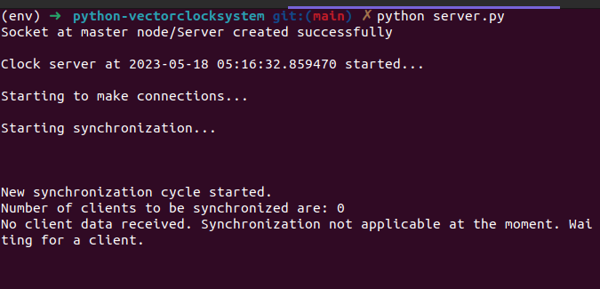
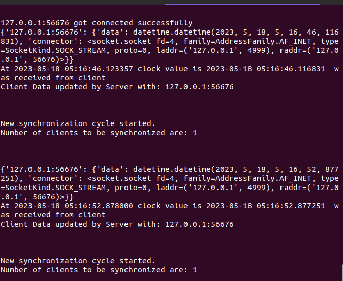
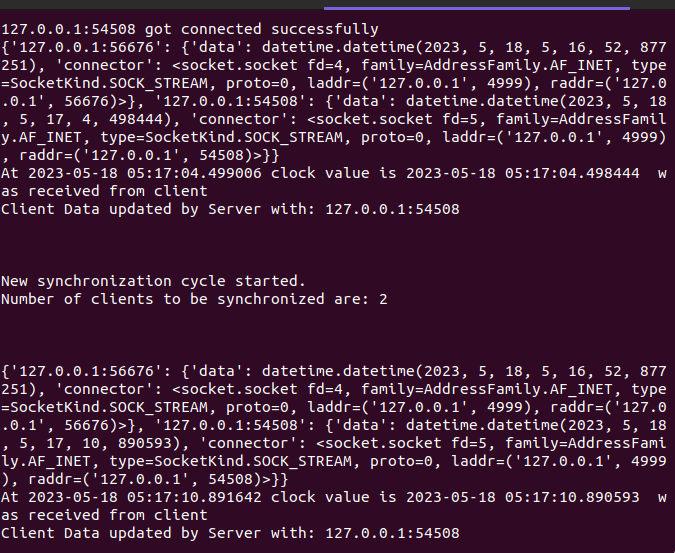

# Vector Clocks for Server-Client Communication

This program implements vector clocks as logical clocks between server and client nodes. The program has three clients: `client`, `client2`, and `client3`, which listen on different ports. The server receives data from the clients and increments its clock by one. Then, it sends an average of the clocks from the clients to set the time for all clients to be the same.

## Usage

1. Clone the repository:

   ```bash
   https://github.com/Mutukukioko/python-vectorclocksystem.git
```

2. Install the necessary dependencies:

   ```bash
   pip install -r requirements.txt
   ```

3. Start the server:

   ```bash
   python server.py
   ```

4. Start the clients:

   ```bash
   python client.py
   python client2.py
   python client3.py
   ```

5. The server will receive data from the clients and increment its clock by one. Then, it will calculate the average of the clocks and send the updated time to all clients.

## Future Recommendations

1. Implement a feature where a client can send messages to other clients.
2. Enhance the program to calculate and display the time differences between clients.
3. Implement error handling and validation to ensure the stability and reliability of the program.
4. Add unit tests to verify the correctness of the clock synchronization algorithm.
5. Improve the user interface and provide a more user-friendly interaction with the program.
6. Consider implementing security measures to protect the communication between the server and clients.

Feel free to contribute to this project by creating pull requests or suggesting improvements.

## License

This project is licensed under the [MIT License](LICENSE).

## Screenshots





Insert relevant screenshots of the program in action to provide visual context and help users understand the application better.
